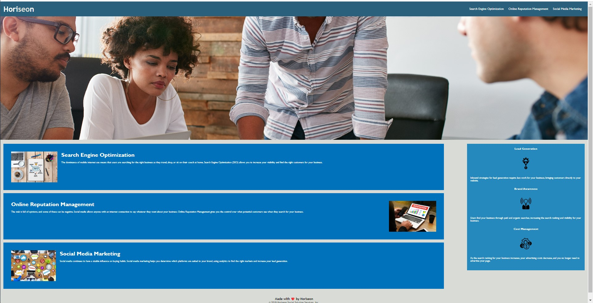

# Module 1 Challenge

# 

# The Challenge

The challenge was to refactor the code to meet accessibility standards by using semantic HTML elements.

## Acceptance Criteria

- WHEN I view the source code
- THEN I find semantic HTML elements
- WHEN I view the structure of the HTML elements
- THEN I find that the elements follow a logical structure independent of styling and positioning
- WHEN I view the image elements
- THEN I find accessible alt attributes
- WHEN I view the heading attributes
- THEN they fall in sequential order
- WHEN I view the title element
- THEN I find a concise, descriptive title

## Landing Page

[Link to the refactored Horiseon website.](https://robles1999.github.io/horiseon/#social-media-marketing)

## Built with

Website was built using basic HTML and CSS code by a beginner coder.
